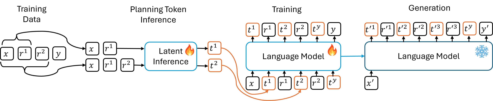

# Guiding Language Model Math Reasoning with Planning Tokens



This is the official reposaitory for paper [Guiding Language Model Math Reasoning with Planning Tokens](https://arxiv.org/abs/2310.05707). We assume that there is a latent variable (infered from previous context) governing the generation of each reasoning step. Since the text within each step is usually short and coherent, we can assume that the distribution of the latent variable does not change much, so we can use a discrete variable as approximation. By providing an approximation of the latent variable as special new tokens at beginning at each step, we can increase the quality of the generated reasoning steps by both increasing the compute capacity before the step and providing more relevant information. We call these special tokens ‘planning tokens’. 

In a chain-of-thought (CoT) fine-tuning setting, we infer these planning tokens from the training data by first cumulatively embedding the question ($x$) and all previous steps ($r$) with the LLM, then train another inference model (e.g. k-means, vae) to inference the planning token type ($t$). Then we fine-tune a pre-trained LLM with the planning token augmented CoT data by adding planning tokens as new tokens into the vocabulary. Empirical results across three math world datasets and various LLMs demonstrate the effectiveness of our algorithm.

## Usage

All data and models can be loaded from Huggingface. A huggingface Hub token is required to use the Llama family models. To set up the environment, run
```
pip install -r requirements.txt 
```
We use python 3.9 for all experiments.

### Planning token inference

There are pre-trained planning token inference models in `./load_data/step_types`. See subfolders for corresponding embedding model names. If you want to train your own model, the `step_type.sh` script can be used for training a planning token inference model from the embedding training data. The checkpoints will be saved in `./load_data/extract_steps`. 

Key arguments:

* `--dataset`: Possible choices of datasets: `gsm8k`, `math`, `aqua`. Note that `math` is hard and `aqua` is significantly larger than the other two datasets.

* `--model_name_or_path`: Embedding model name/path.

* `--batch_size`: Only affect embedding computation.

* `--selection_method`: Planning token inference model type. `vae` corresponds to **SQ-VAE** in the paper. `k-means` corresponds to **K-Means** in the paper. `+-*/` corresponds to **Arithmetic** in the paper.

* `--num_plan_types`: number of planning types.

### Training

The `train.sh` script can be used for (parameter efficient) fine-tuning a pre-trained language model with CoT data. The accuracy evaluation has been built in the training loop. If performing parameter efficient fine-tuning, only the adapters and the newly added token embeddings will be saved in the checkpoint in `./checkpoints`.

Key arguments:

* `--dataset`: Same as `--dataset` in `./load_data/step_types`.

* `--model_name_or_path`: Base model name/path.

* `--add_soft_prompts`: A binary argument determining whether to use planning tokens or not.

* `--parameter_efficient_mode`: Whether to perform parameter efficient fine-tuning. `none` means full fine-tuning. `lora` means LORA fine-tuning. `prompt-tuning` means tuning the embeddings of newly added tokens. To use planning tokens with LORA fine-tuning, this argument needs to be set as `lora+prompt-tuning`. The parameter efficient fine-tuning alghorithms are implemented based on the [PEFT](https://github.com/huggingface/peft) library. 

* `--num_general_prefix_tokens`: *n_prefix* in the paper.

* `--num_special_prefix_tokens`: *n_special* in the paper.

* `--extract_step_type_tokens`: same as `--selection_method` in `step_type.sh`.

* `--num_plan_types`: same as `--num_plan_types` in `step_type.sh`.

* `--model_max_length`: We set this to 512 for `gsm8k` and 1024 for `math` and `aqua`.

* `--num_test`: The maximum number of testing examples to be evaluated at the end of each epoch. We set this to 1000.

* `--int8_training`: Turn on this flag to save more GPU memories. Might impact the model performance.

### Evaluation

In the paper, we report the epoch producing the highest eval accuracy. The accuracy evaluation has been built in the training loop, and can be checked in the `trainer_state.json` file saved in the checkpoints as `eval_acc`.

To do evaluation sparately and save the generation results, use the script `eval.sh`. Need to make sure all the corresponding arguments are the same as the the training arguments in `train.sh`. The model generation results will be saved in the same directory as the loaded checkpoint. The saving format would be question - empty line - generated solution - empty line - ground truth solution.

Key arguments:

* `--model_name_or_path`: Checkpoint path. 

* `--base_model_name_or_path`: Base model for paramter efficient fine-tuning checkpoints. Must be the same as the `--model_name_or_path` in `train.sh` to correctly load the checkpoints.

* Please follow `train.sh` for other arguments.

## Citation

* To cite our paper:
    ```
    @article{wang2023guiding,
    title={Guiding language model reasoning with planning tokens},
    author={Wang, Xinyi and Caccia, Lucas and Ostapenko, Oleksiy and Yuan, Xingdi and Wang, William Yang and Sordoni, Alessandro},
    journal={arXiv preprint arXiv:2310.05707},
    year={2023}
    }
    ```